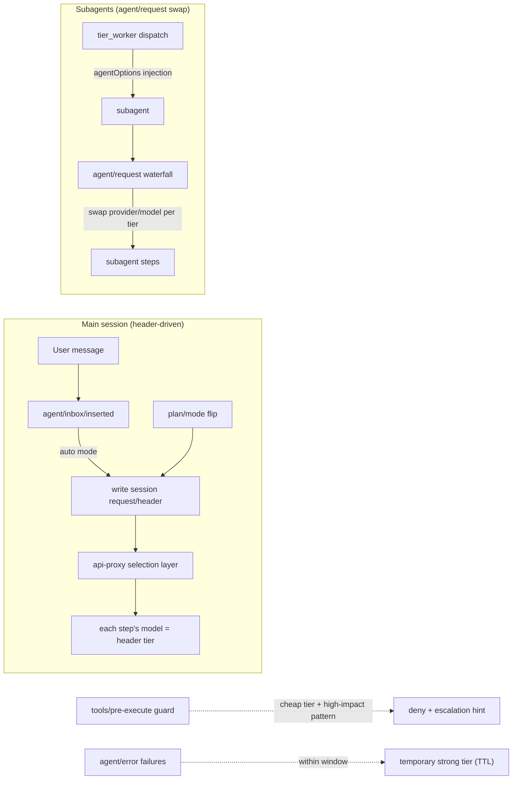
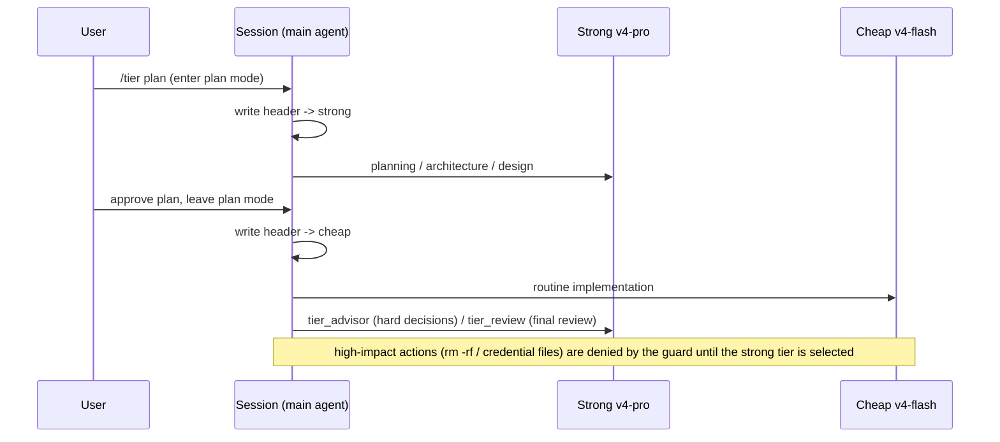

# dsh-tier-router — Tiered model routing for DeepSeek Harness

[](LICENSE)
[](https://github.com/topics/dsh-plugin)

Routes model steps by task difficulty: a **strong tier (deepseek-v4-pro by default)
handles planning / architecture / review**, while a **cheap tier (deepseek-v4-flash by
default) handles day-to-day implementation**. Inspired by Claude Code's `/advisor`
(consult a stronger model for hard decisions) and `opusplan` (strong model in plan mode,
cheap model for execution), implemented on DeepSeek Harness through its official seams,
with an escalation gate, failure auto-escalation, and subagent tiering on top.

English · [中文](README.zh.md)

## How it works





## Features

- **Automatic tiered routing (auto mode, opusplan-style)**: steps run on the strong tier
  while plan mode is active and on the cheap tier during execution. Main sessions are
  routed by writing the session `request/header` (the official seam the api-proxy selection
  layer reads, as community plugins like `dsh-model-router` do); subagents are switched
  per step at the `agent/request` waterfall.
- **Per-session scoping**: `/tier strong|cheap|auto|off` affects **only the current
  session**; other sessions in the process keep their own tier (global default `auto`).
  Sessions that should not be managed can opt out with a single `/tier off`.
- **On-demand advice (advisor-style)**: the `/advisor <question>` command and the
  `tier_advisor` tool hand one decision question plus gathered evidence to the strong
  tier and return advice / evidence / risks / acceptance criteria; implementation stays
  on the current tier.
- **Review phase**: the `tier_review` tool and `/tier review <focus>` ask the strong tier
  to review a change set and return an `APPROVE / NEEDS-CHANGES / BLOCKED` verdict with
  issues ranked by severity.
- **Failure auto-escalation**: repeated step errors within a window (default 2 errors /
  60s) temporarily escalate the session to the strong tier (default 180s), expiring via
  TTL; sessions in `off` mode never escalate.
- **Configurable tiers**: `/tier set <strong|cheap> <provider> <model> [effort]` or the
  `tier_configure` tool can point either tier at any registered provider/model (defaults:
  `deepseek-official/deepseek-v4-pro(max)` and `deepseek-official/deepseek-v4-flash(high)`).
- **High-impact escalation gate (deterministic guard)**: while the cheap tier executes,
  `tools/pre-execute` denies high-impact tool calls and requires switching to the strong
  tier first — no reliance on model self-discipline. Guard rules (pure logic in
  `lib/pure.js`, unit-tested):
  - every `rm -rf` spelling: combined flags (`-rf`), split flags (`-r -f`), case variants
    (`-R`), long flags (`--recursive --force`), runner prefixes (`sudo rm -rf`, `busybox rm`);
  - destructive commands: `mkfs`, `dd if=`, `sudo`, `shutdown/reboot/halt`,
    `git push --force/-f`, `curl|sh`, `wget|sh`, `chmod` on `.ssh`, `chown`;
  - sensitive paths: `.env` (whitelist for `.env.example/.template`), `credentials`/`secrets`
    with common extensions, `.ssh/`, private keys such as `id_rsa` (case-insensitive),
    `.pem`, `.key`;
  - prose never false-positives: `echo rm -rf`, `grep sudo` do not trigger
    (command-position anchored).
- **Subagent tiering**: `tier_worker` dispatches bounded task packets to a fresh subagent
  on a chosen tier (`agentOptions` model injection), with `outputSchema` (structured
  results), `toolFilter` (restrict worker tools), `maxDepth` (delegation-depth cap) and
  `persona` (per-child persona); `/tier subagent <inherit|cheap|strong>` sets the global
  policy for all other subagent steps.
- **Escalation rules injected into the system prompt**: ambiguity unresolved,
  architecture / security / data integrity, two failed attempts, high-risk completion —
  the model is guided to call `tier_advisor` / `tier_review` at decision points.

## Installation

```sh
# Local directory install (development / verification)
git clone https://github.com/BruceLanLan/dsh-tier-router.git
cd dsh-tier-router
dsh plugin --profile web add .

# Restart DSH for the bundle to activate. Once published, one-line install:
# dsh plugin --profile web add dsh-tier-router
```

Uninstall:

```sh
dsh plugin --profile web remove dsh-tier-router
```

Installation has been verified in practice: `dsh plugin --profile <name> add <path>`
links the bundle, `dsh --profile <name> --dump-config` shows the
`- id: tier-routing / name: dsh-tier-router` row composed correctly, module loading is
smoke-tested, and `npm pack` ships a clean tarball (17KB: lib + patch + README/LICENSE).

## Usage

### Slash commands (typed in the composer; they affect only the current session)

```
/advisor <question>                          # one strong-tier consultation
/tier status                                # routing state, escalation state, diagnostics
/tier strong | cheap                        # force one tier for this session (optionally persist as session default)
/tier auto                                  # restore auto for this session (plan -> strong, execution -> cheap)
/tier off                                   # disable routing for this session, restore its default model (other sessions unaffected)
/tier plan                                  # auto + enter plan mode, apply the strong header immediately
/tier models                                # list registered providers and their models
/tier set <strong|cheap> <provider> <model> [effort]
/tier subagent <inherit|cheap|strong>       # global policy for subagent steps
/tier review <focus>                        # strong-tier review
```

Sample output (`/tier status`):

```
Tiered model routing
  mode: global=auto, this session=auto (per-session via /tier strong|cheap|auto|off; escalate: 2 errors / 60s window -> 180s strong)
  strong: deepseek-official/deepseek-v4-pro (max)
  cheap:  deepseek-official/deepseek-v4-flash (high)
  subagents: inherit
  diag: requestSteps=42 guardChecks=31 guardDenies=3 headerWrites=4 errorsSeen=0 escalations=0
  session default: deepseek-official/deepseek-v4-pro (max)
  providers: deepseek-official, opencode-go, minimax
```

### Model tools (called by the model when needed)

| Tool | Purpose |
| --- | --- |
| `tier_advisor` | Strong-tier consultation: one question + evidence -> advice / risks / acceptance criteria |
| `tier_review` | Strong-tier review: change set + validation results -> verdict with ranked issues |
| `tier_route` | Set **this session's** tier (strong/cheap/auto/off, optionally persisted) |
| `tier_configure` | Reconfigure either tier's provider/model/effort and the subagent policy |
| `tier_worker` | Dispatch a bounded task packet to a subagent on a chosen tier; supports outputSchema / toolFilter / maxDepth / persona |
| `tier_status` | Read-only diagnostics: global & session tiers, escalation state, listener counters, effective tier |

## Configuration

Runtime configuration (no restart needed):

```sh
/tier set strong deepseek-official deepseek-v4-pro max
/tier set cheap deepseek-official deepseek-v4-flash high
```

`tier_route strong|cheap` persists the choice as the session default model by default
(writes the `agent-default-model` setting); `tier_configure` supports `persist: true`
for the same. Failure auto-escalation parameters (threshold / window / TTL) are currently
built-in constants; configurable in a later version.

## Tests

```sh
npm test        # node:test — 18 cases: guard positive/negative matrix, tier decision precedence, per-session overrides
npm run check   # syntax check for lib/index.js and lib/pure.js
```

Verified in live multi-round sessions (dynamic-plugin form):

| Area | Result |
| --- | --- |
| Main-session per-step routing (durable log evidence) | ✅ `request/header` events show the pro -> flash switch |
| Guard matrix (auto/strong/off) | ✅ auto denies / strong allows / off allows + restores default / auto-restored denies |
| Guard hardening (split flags, runner prefixes, prose, .env whitelist, case) | ✅ 7/7 live probes |
| Tools, positive paths | ✅ advisor/review hit the strong tier; route modes; configure; worker on both spawn and fork providers |
| Worker options | ✅ outputSchema structured result, toolFilter restriction, maxDepth rejection, invalid filter error |
| Tools, negative paths | ✅ invalid provider rejected, invalid subagent provider error |
| Subagent tiering | ✅ cheap tier on flash, strong tier on pro (child logs + return values) |
| Failure-escalation event path | ✅ `agent/error` fires, counters increment, off mode correctly skips |
| Lifecycle | ✅ stop removes guard & tools; re-run restores everything and the guard works |
| Persistence | ✅ `agent-default-model` written |
| Cross-turn listener survival | ✅ diagnostic counters keep incrementing across turns |

## FAQ

**Q: Why was another session's model switched automatically?**
Early versions were process-global. Since v0.3.0 `/tier` commands scope to the **current
session** only; other sessions default to `auto` independently. A session that should not
be managed runs `/tier off` to opt out.

**Q: The tier switch did not take effect immediately?**
Tier switches are written to the session header before the step is built, so they apply
from the **next step** (one-step delay).

**Q: How do I use subscription-channel models (OpenCode Go / MiniMax)?**
Run `/tier models` to confirm the provider is registered and its models are configured,
then `/tier set cheap opencode-go deepseek-v4-flash`. pi-ai-style providers must declare
`baseURL` / `api` / `models` in settings.yaml, otherwise every model id is rejected.

**Q: A high-impact action was blocked. What now?**
The guard's message tells you: switch to the strong tier first (`tier_route strong` or
`/tier strong`) and re-issue — the block exists precisely to keep the cheap tier from
running destructive actions directly.

**Q: `/tier` does not appear after installing the bundle?**
The bundle activates only after restarting `dsh web`. The dynamic-plugin form is a
process-local temporary instance and disappears on restart.

## Known limitations

- Tier switches take effect from the next step (the header is written before the step builds).
- The subagent global policy (`/tier subagent`) is process-wide; a worker's per-dispatch
  tier always wins.
- The full live "fail -> self-heal" sequence for failure auto-escalation has been verified
  at the event path and unit-logic level; trigger it live per the FAQ if desired.

## License

MIT
