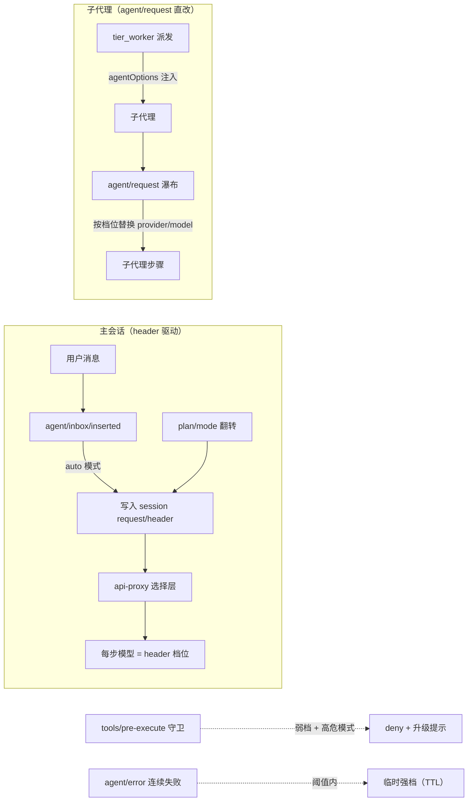
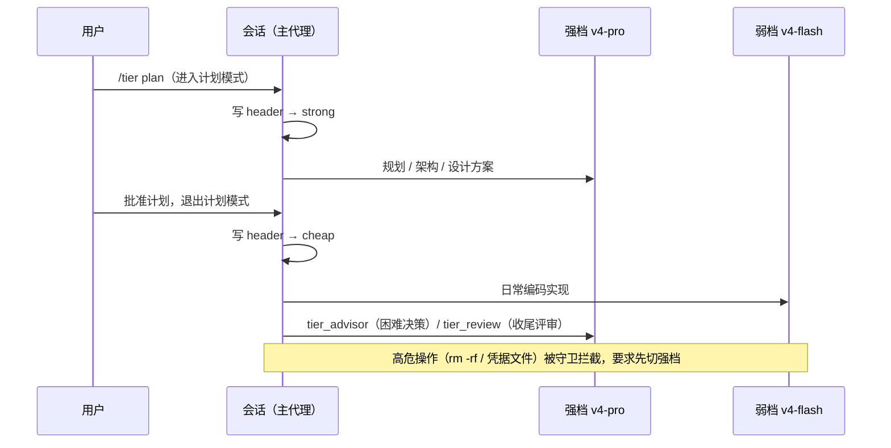

# dsh-tier-router — 分层模型路由 for DeepSeek Harness

[](LICENSE)
[](https://github.com/topics/dsh-plugin)

按任务难度分层路由模型：**强档（默认 deepseek-v4-pro）负责规划 / 架构 / 评审**，
**弱档（默认 deepseek-v4-flash）负责日常编码实现**，并支持每档回退链与按任务强度
自动选择思考强度。灵感来自 Claude Code 的
在 DeepSeek Harness 里用官方机制实现，并扩展了难度升级门、失败自动升级与 subagent 分层。

[English](README.md) · 中文

## 工作原理





## 功能

- **自动分层路由（auto 模式，opusplan 式）**：进入计划模式时步骤跑强档，执行步骤跑弱档。
  在 agent loop 构建首个或恢复后的请求前，路由器会同步 agent 的模型 options 与持久化
  `request/header`；后续切换会保留 `maxTokens` 等无关请求配置。
- **按会话隔离（per-session）**：`/tier strong|cheap|auto|delegated|off` 只影响当前会话，
  **进程内其他会话保持自己的档位**（全局默认 `auto`）。`delegated` 模式下主会话保持模型
  选择器的选项，只有子代理使用分层路由；`/tier auto` 仍是显式的本会话覆盖。不想被管理的
  会话发一次 `/tier off` 即可退出。
- **按需咨询（advisor 式）**：`/advisor <问题>` 命令 + `tier_advisor` 工具，把一个问题
  加已有证据交给强档模型，返回建议 / 证据 / 风险 / 验收条件；实现仍由当前档执行。
- **评审阶段**：`tier_review` 工具 + `/tier review <焦点>`，强档模型对变更与验证结果
  给出 `APPROVE / NEEDS-CHANGES / BLOCKED` 及分级问题清单。
- **失败自动升级**：同一会话在窗口内连续出错（默认 60s 内 2 次）自动临时切到强档
  （默认 180s），TTL 过期自动回落；`off` 会话不参与。
- **每档回退链**：每个 tier 都有有序回退链。主模型不可用（未知模型、配额、限流、
  凭据缺失/失效、server/transport 错误或任意 >= 500）时，路由器在受支持的
  request-error 边界切换到下一项并重试同一步。移除全部条目即可关闭回退。回退状态按
  agent 与 tier 分开记录，TTL（默认 5 分钟，`state.fallbackTtlMs`）后回到主模型，
  且计划模式切换不会把弱档回退链误解释为强档回退链。
- **可配置双档（持久化）**：`/tier set <strong|cheap> <provider> <model> [effort]` 或
  `tier_configure` 工具可修改任意已注册 provider / model、让强档跟随会话模型选择，并配置
  有序回退链。配置持久化于 `tier-router` settings 命名空间，传 `sessionOnly: true` 可只改内存。
- **WebUI 设置页**：Tier routing 页面可配置 provider、模型、思考强度、跟随会话、回退链、
  路由模式和子代理策略；可用时使用实时模型目录，目录不可用时保留自定义路由。
- **高危升级门（确定性守卫）**：当执行档为弱档时，`tools/pre-execute` 拦截高危工具调用，
  要求先切到强档再执行，不依赖模型自觉。守卫规则（纯逻辑 `lib/pure.js`，单元测试覆盖）：
  - `rm -rf` 全拼写：合并参数（`-rf`）、拆分参数（`-r -f`）、大小写（`-R`）、长参数
    （`--recursive --force`）、前缀命令（`sudo rm -rf`、`busybox rm`）；
  - 破坏性命令：`mkfs`、`dd if=`、`sudo`、`shutdown/reboot/halt`、`git push --force/-f`、
    `git clean -f*`、`find ... -delete` / `find ... -exec rm`、`python -c` 里的
    `shutil.rmtree` / `os.remove`、`curl|sh`、`wget|sh`、`chmod` 到 `.ssh`、`chown`；
  - 敏感路径：`.env`（`.env.example/.template` 白名单例外）、`credentials`/`secrets`
    常见扩展名、`.ssh/`、`id_rsa` 等私钥（大小写不敏感）、`.pem`、`.key`；
  - 散文不误伤：`echo rm -rf`、`grep sudo` 之类不触发（锚定命令位置）。
- **subagent 分层**：`tier_worker` 按档派发子代理（`agentOptions` 注入模型），支持
  `outputSchema`（结构化结果）、`toolFilter`（限制子代理工具）、`maxDepth`（深度上限）、
  `persona`（子代理人格）、`background`（jobs 后台执行）；`/tier subagent
  <inherit|cheap|strong>` 也会在普通 `subagent` 与 `subagent_fork` 的首个请求前应用
  对应路由。自动升级始终受 TTL 限制，不会永久覆盖 worker 显式选择的档位。
- **难度升级规则注入**：向系统提示词注入升级门（歧义未消、架构 / 安全 / 数据完整性、
  两次失败、收尾高风险等条件），模型在决策点调用 `tier_advisor` / `tier_review`。

## 安装

> **作用域说明**：`dsh-tier-router` 的路由能力仍属于 **agent 层**：工具、斜杠命令、
> 提示词段落和监听器只在会话选择 `tiered` 时挂载。profile bundle 的 host 侧现在只
> 负责一件事：DSH 启动时把包内 `tiered` preset 同步到发现根目录。

```sh
# 1. 安装到 profile。下次启动 DSH 时，host bundle 会把包内 tiered preset
#    自动同步到 ~/.dsh/.agent-presets。
dsh plugin --profile web add dsh-tier-router

# 本地开发同样使用该安装路径：
dsh plugin --profile web add .

# 2. 重启 DSH，在新会话的预设选择器中选择 “tiered”
#    （或在 agent-presets 中设为默认）。不需要手动拷贝 preset。
```

卸载：执行 `dsh plugin --profile web remove dsh-tier-router`；下次启动 DSH 后不再更新
`tiered` preset。仅在不再需要时，单独删除 `~/.dsh/.agent-presets/tiered`。

安装已实测：包能从 profile store 正确解析；仓库自带的 `agent-presets/tiered`
preset（standard 副本 + `- id: tier-routing / name: dsh-tier-router` 行）通过
`agentPresets.standingKeyFor` 挂载校验；模块加载冒烟通过；`npm pack` 内容干净
（lib + patch + preset + README/LICENSE）。

### 安装后验收清单

1. **重启 DSH**：先杀掉 LISTEN 在 web 端口的进程（`lsof -tiTCP:<端口> -sTCP:LISTEN | xargs kill -9`），再启动。
2. **新开一个会话**——已存在的会话保留创建时的 preset（设计如此）。
3. 运行 `/tier status`，必须看到：
   - `config persisted: yes (tier-router settings namespace)`
   - 两个 tier 各自的 provider/model/effort
   - `diag:` 行为非空的实时计数器
4. 该会话里必须能调用 `tier_status` / `tier_route` / `tier_configure` /
   `tier_advisor` / `tier_review` / `tier_worker` 六个工具。
5. 廉价档执行期间，高危命令（如 `rm -rf`、`sudo …`）必须被守卫拒绝并给出升级提示。
6. `/tier set strong <provider> <model> [effort]` 必须回复 `Saved to
   tier-router settings.` 且重启后仍然生效。

如果 `/tier status` 不可用：说明该会话的 preset 里缺 `tier-routing` 行（见"安装"），
或该会话创建于切换默认 preset 之前。

## 使用

### 斜杠命令（在输入框直接输入，只作用于当前会话）

```
/advisor <决策问题>                          # 强档模型一次咨询
/tier status                                # 查看路由状态、升级状态与诊断计数器
/tier strong | cheap                        # 本会话强制走某档（可选持久化为会话默认）
/tier auto                                  # 本会话恢复自动（计划模式→强档，执行→弱档）
/tier delegated                             # 主会话保持模型选择器，仅对子代理分层
/tier off                                   # 本会话关闭路由并恢复默认模型（不影响其他会话）
/tier plan                                  # auto + 进入计划模式，并立即应用强档 header
/tier models                                # 列出已注册 provider 与其模型
/tier set <strong|cheap> <provider> <model> [effort]
/tier subagent <inherit|cheap|strong>       # 子代理全局档位策略
/tier review <评审焦点>                       # 强档模型评审
```

示例输出（`/tier status`）：

```
Tiered model routing
  mode: global=auto, this session=auto (per-session via /tier strong|cheap|auto|delegated|off; escalate: 2 errors / 60s window -> 180s strong)
  strong: deepseek-official/deepseek-v4-pro (max)
  cheap:  deepseek-official/deepseek-v4-flash (medium)
  subagents: inherit
  diag: requestSteps=42 guardChecks=31 guardDenies=3 headerWrites=4 errorsSeen=0 escalations=0
  session default: deepseek-official/deepseek-v4-pro (max)
  providers: deepseek-official, opencode-go, minimax
```

### 模型工具（由模型在需要时调用）

| 工具 | 用途 |
| --- | --- |
| `tier_advisor` | 强档咨询：一个问题 + 证据 → 建议 / 风险 / 验收条件 |
| `tier_review` | 强档评审：变更集 + 验证结果 → 判定与分级问题 |
| `tier_route` | 设置**本会话**档位（strong/cheap/auto/delegated/off，可选持久化） |
| `tier_configure` | 重配任意档位的 provider/model/effort 与 subagent 策略 |
| `tier_worker` | 按档派发子代理执行有界任务包；支持 outputSchema / toolFilter / maxDepth / persona |
| `tier_status` | 只读诊断：全局与本会话档位、升级状态、监听器计数器、生效档位 |

## 配置

运行时配置（无需重启）：

```sh
/tier set strong deepseek-official deepseek-v4-pro max
/tier set cheap deepseek-official deepseek-v4-flash medium
```

`/tier set` 与 `tier_configure` 会把双档配置持久化到 `tier-router` settings 命名空间
（重启不丢；`sessionOnly: true` 可只改内存）。`tier_route strong|cheap|delegated` 只影响当前会话
且默认不持久化，传 `persist: true` 才写入会话默认模型（`agent-default-model`）。
失败自动升级参数（阈值 / 窗口 / 时长）当前为内建常量，后续版本可配置化。

## 测试

```sh
npm test        # node:test — 20 个用例：守卫正反矩阵、档位决策优先级、per-session 覆盖
npm run check   # 语法检查 lib/index.js 与 lib/pure.js
```

会话内严格多轮实测（动态插件形态）记录：

| 项目 | 结果 |
| --- | --- |
| 主会话每步路由（持久日志证据） | ✅ `request/header` 事件显示从 pro 切到 flash |
| 守卫矩阵（auto/strong/off） | ✅ auto 拒 / strong 放行 / off 放行并恢复默认档 / 恢复 auto 拒 |
| 守卫加固（拆分参数、前缀 rm、散文、.env 白名单、大小写） | ✅ 7/7 实测通过 |
| 工具正向 | ✅ advisor/review 真调强档；route 四种模式；configure 改档；worker 在 spawn 与 fork 两个 provider 上完成 |
| worker 新参数 | ✅ outputSchema 结构化结果、toolFilter 限制工具、maxDepth 拒绝超限、非法 filter 干净报错 |
| 工具反向用例 | ✅ 非法 provider 拒绝、非法 subagent provider 报错 |
| subagent 分层 | ✅ 弱档跑 flash、强档跑 pro（子代理日志与返回值证实） |
| 失败升级事件路径 | ✅ `agent/error` 真实触发、计数器自增、off 模式正确跳过 |
| 生命周期 | ✅ stop 后守卫与工具消失；重新 run 全部恢复且守卫生效 |
| 持久化 | ✅ `agent-default-model` 写入成功 |
| 跨回合监听器存活 | ✅ 诊断计数器跨回合持续自增 |

## FAQ

**Q: 为什么我另一个会话的模型被自动切换了？**
早期版本是进程级全局模式。v0.3.0 起 `/tier` 命令只作用于**当前会话**，
其他会话默认 `auto` 且互不影响；不想被管理的会话输入 `/tier off` 即可退出。

**Q: 切换档位后没有立刻生效？**
档位切换在步骤构建前写入会话 header，从**下一步**开始生效（一步延迟）。

**Q: 想用订阅渠道的模型（如 OpenCode Go / MiniMax）？**
先 `/tier models` 确认 provider 已注册、模型已配置，再
`/tier set cheap opencode-go deepseek-v4-flash`。pi-ai 类 provider 必须在
settings.yaml 中声明 `baseURL`/`api`/`models`，否则任何模型 id 都会被拒绝。

**Q: 高危操作被拦了怎么办？**
守卫的提示会告诉你：先 `tier_route` 切到 `strong`（或 `/tier strong`）再重试——
拦截本身就是为了避免弱档模型直接执行破坏性操作。

**Q: 装完 bundle 后 `/tier` 不出现？**
本插件是 agent 层插件：必须是你所用会话的 agent preset 里的一行（见"安装"）。
只作为 host bundle 行安装不会激活任何东西——agent 层服务（tools/commands/
systemPrompt）在 host 根作用域不可达，因此本包**故意不带 host 插入行**。加入
preset 行后重启 `dsh web` 并新开会话，用 `/tier status` 验证。（动态插件形态是
进程内临时实例，重启即消失。）

## 已知限制

- 档位切换从下一步生效（header 在步骤构建前写入）。
- 子代理全局档位策略（`/tier subagent`）是进程级的；worker 的单次派发档位始终优先。
- 失败自动升级的完整"失败→自愈"现场序列在会话内已验证事件路径与单元逻辑，端到端
  现场触发建议按 FAQ 操作验证。

## 许可

MIT